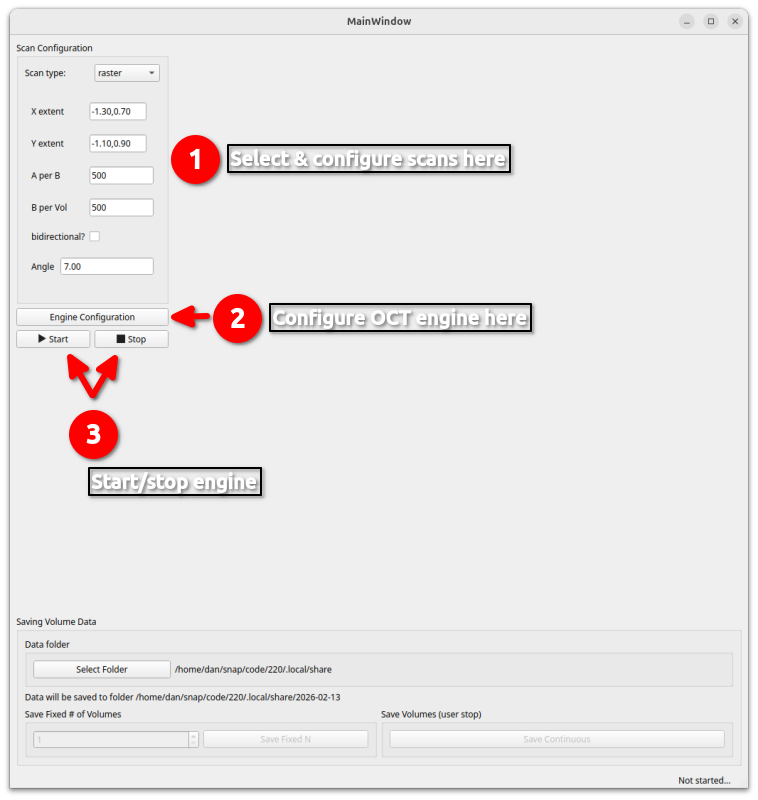
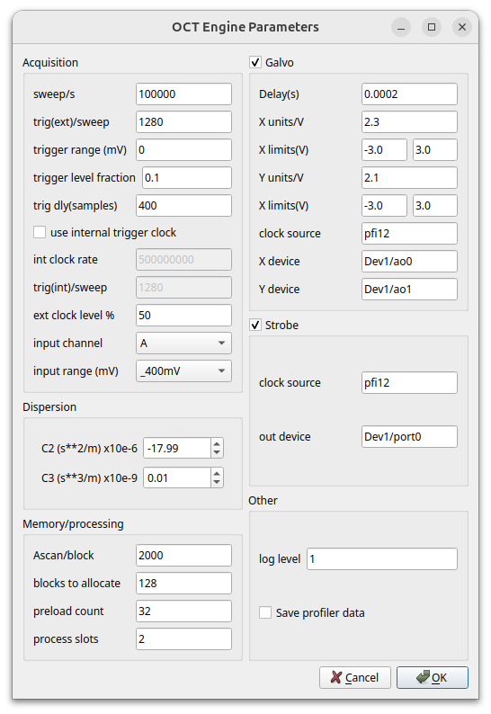

# VORTUP: Instrumentation software for slo-oct device at EyePod

This application will control the SLO-OCT device at UCDavis. More generally, I hope it will control a device similar to this one. the main limitation is hardware, specifically the acquisition and IO cards used. This software will work with acquisition cards from Alazar, and IO cards from National Instruments (NI-DAQmx cards).


## Table of contents

* [Usage](#usage)
* [Known issues and limitations](#known-issues-and-limitations)
* [Getting help](#getting-help)
* [License](#license)
* [Acknowledgments](#acknowledgments)


## Usage

### Installation

Install CUDA for your device, then install from the requirements file - see below. 

This code works with python 3.10 and 3.12 on Windows. I have not tested hardware on a linux machine.

```
git clone https://github.com/djsperka/vortup
cd vortup
pip install -r requirements.txt
```

### Initial configuration file

Initialize a configuration file. From the folder where the code is installed, run OCTUiParams to create a new config file:


```
dan@bucky:~$ cd work/oct/vortup/
dan@bucky:~/work/oct/vortup$ 
dan@bucky:~/work/oct/vortup$ python OCTUiParams.py --create
INFO:OCTUiParams:creating new config file
INFO:OCTUiParams:loading OCTUi config from /home/dan/work/oct/vortup/octui.conf
INFO:OCTUiParams:saving OCTUi config to /home/dan/.octui/octui.conf
INFO:OCTUiParams:Creating directory /home/dan/.octui
INFO:OCTUiParams:Done.
```

### Basic operation

 

On startup, the application reads its configuration file and opens the main dialog. Parameters for each of the scan types are specified here. OCT engine parameters are specified by clicking the __Engine Configuration__  button. The __Start__ and __Stop__ buttons start and stop scanning.

### Engine Configuration

There are six sections of the Engine Configuration dialog: Acquisition, Dispersion, Memory/processing, Galvo, Strobe, and Other.

 

#### Acquisition

These parameters configure the acquisition card. An Alazar card is assumed, and some tweaks specific to UCD's Alazar 9750 card are present (see VtxEngine.py and VtxBaseEngine.py). 

- **sweep/s**
: Sweep trigger rate
- **trig(ext)/sweep**
: How many K-clock triggers expected per sweep. K-clock signals used for sampling must be connected to Alazar card *ECLK* port.
- **trigger range(mV)**
: Full range for trigger signal. See Alazar docs. We use 0 to indicate TTL. 
- **trigger level fraction**
: Fraction of full range trigger signal to use as threshold. See Alazar docs.
- **trigger dly(samples)**
: See Alazar docs. 
- **use internal clock**
: if checked, use the Alazar card's own clock to generate sampling triggers. If unchecked, will use K-clock signals in *ECLK* port.
- **int clock rate**
: only used if *"use internal clock"* is checked. See Alazar docs for allowed values
- **trig(int)/sweep**
: only used if *"use internal clock"* is checked. Number of K-clock triggers per sweep.
- **ext clock level %**
: threshold for external clock
- **input channel**
: Alazar card has two channels for input
- **input range(mV)**
: input range for signals on input channel. *Alazar 9750 (UCD's card) only accepts 400mV range!*

#### Dispersion

Dispersion parameters used to correct for wavelength-dependent phase distortion. 
- **C2**
: "linear chirp", or "group velocity dispersion"
- **C3**
: "quadratic chirp" or "third order dispersion"

#### Memory/processing

These parameters can be used to optimize resource usage (GPU and system memory). Ascans are collected and processed in *blocks*. Blocks are filled with newly-acquired data, passed to the GPU for OCT processing (if any), then formatted and passed to endpoints for plotting (and maybe saving to disk). The size of a block will affect the time it takes for CUDA processing. Ideally, a rate of 50-200 blocks per second should be processed. The size of a block (in ascans) can be raised or lowered to optimize the rate. 

- **Ascan/block**
: number of ascans per block
- **blocks to allocate**
: how many total blocks should be allocated
- **preload count**
: number of blocks to be pre-loaded before engine starts
- **process slots**
: number of separate GPU slots to use for processing

#### Galvo

The galvonometers are driven by signals generated by the NIDAQ card. The checkbox on the *Galvo* section of the dialog enables (checked) or disables (unchecked) the galvonometer output. The engine will run without the galvonometer signals, but the mirrors won't move!

- **delay(s)**
: IO delay in galvo signals. This value represents the time between when a given galvo voltage is output, and when the mirror is actually in that position. Use the "Galvo Tuning" scan to determine this value.
- **X units/V**
: Conversion between scan coordinate X-distance and volts
- **X limits(V)**
: Min and max absolute voltage limits for X output
- **Y units/V**
: Conversion between scan coordinate Y-distance and volts
- **Y limits(V)**
: Min and max absolute voltage limits for Y output
- **clock source**
: NI line used for (sweep trigger) clock. The sweep trigger starts the output for the galvos. The Alazar card is configured to pass the sweep trigger to its auxiliary output. We route that output to NIDAQ *PFI12*, or something like that.
- **X device**
: NI analog output channel (in the form *device/port*, e.g. *Dev1/ao0*) for the X/fast axis.
- **Y device**
: NI analog output channel (in the form *device/port*, e.g. *Dev1/ao1*) for the Y/slow axis.


#### Strobe

The strobes are digital signals that the engine can generate for synchronization. The clock source can be the same as that used for the galvonometers. The checkbox on the *Strobe* section of the dialog enables (checked) or disables (unchecked) the strobe output. The engine will run without the strobe signals.

- **clock source** 
: NI line used for the clock which controls the strobe generation. Can be same as that used for galvonometers.
- **out device**
: NI device/port where the strobe output should go. The port consists of 8 digital lines. The specific line for a strobe is specified with the scan that requires it.


#### Other

- **log level**
: Set to 1 for normal log output. Set to a higher number for more verbose output.
- **Save profiler data**
: If checked, will save profiler data (in a file called *profiler.log*) for analysis of engine performance. Vortex provides a [tool](https://www.vortex-oct.dev/rel/v0.5.1/doc/develop/profiler/) for analyzing this file.

## Known issues and limitations

None are known at this time.


## Getting help

Contact the developer at djsperka_at_ucdavis_dot_edu.


## License

Copyright &copy; 2025 The Regents of the University of California, Davis campus. All Rights Reserved.

Please see the [LICENSE](LICENSE.md) file for more information.


## Acknowledgments

Development of this software was supported by NIH Vision Research Core Grant, P30EY012576. 

This software replies on many software packages and products. Here are a few significant ones:

* [Vortex - An open-source library for building real-time OCT engines in C++ or Python.](https://www.vortex-oct.dev/)
* [Qt](https://www.qt.io/)
* [PyQT - a set of Python bindings for the Qt application framework.](https://www.riverbankcomputing.com/software/pyqt/)
